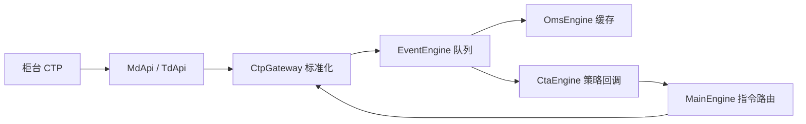

# VeighNa 架构与三个模块的源码映射

## 分层数据流

底层 API 接收柜台字典，Gateway 负责字段、枚举和标识的转换；事件队列连接通信线程与业务模块。中层提供最新状态缓存和指令路由，策略负责信号以及目标持仓。不能把“请求返回 0”“委托受理”和“成交”混为一谈。

## vnpy：标准化、事件总线和 OMS

固定版本 [`c6e231c`](https://github.com/vnpy/vnpy/tree/c6e231caf32b7fc97e6459817fff66458cf7e7c4)。

- [`vnpy/trader/object.py`](https://github.com/vnpy/vnpy/blob/c6e231caf32b7fc97e6459817fff66458cf7e7c4/vnpy/trader/object.py)：`TickData`、`OrderData`、`TradeData`、`PositionData`、`ContractData`、`OrderRequest`。`vt_symbol` 用 symbol 与 exchange 组合避免跨市场重名；委托编号还需 gateway/session 语义，不能只凭 OrderRef 归属。
- [`vnpy/event/engine.py`](https://github.com/vnpy/vnpy/blob/c6e231caf32b7fc97e6459817fff66458cf7e7c4/vnpy/event/engine.py#L35)：`EventEngine._run` 从线程安全 Queue 取事件；`_process` 调用按事件类型登记及通用处理器；定时线程产生 `EVENT_TIMER`。耗时计算会拖慢后续事件，因此回调应短。它不是跨进程消息系统，也不是持久化事件日志。
- [`vnpy/trader/engine.py`](https://github.com/vnpy/vnpy/blob/c6e231caf32b7fc97e6459817fff66458cf7e7c4/vnpy/trader/engine.py#L375)：`OmsEngine` 保存 ticks/orders/trades/positions/accounts/contracts 字典，并单独维护 active_orders。`process_order_event` 根据 `is_active()` 加入/移除活动委托；成交和持仓更新 `OffsetConverter`。缓存是柜台回报在本地的视图，断线时可能陈旧，不能作为最终空仓的唯一证据。
- 同文件 `MainEngine.send_order` 按 `gateway_name` 找到 Gateway 并调用 `gateway.send_order`；找不到时返回空串。它不代替策略风控或成交验收。

## vnpy_ctp：协议接入和业务流程标准化

固定源码 [`1be9bfb`](https://github.com/vnpy/vnpy_ctp/tree/1be9bfb5292208e5c258cc769c90be4abe83f9a9)，源码项目版本 6.7.11.5；本次安装测试的发行包为 6.7.11.4。两者不是同一构建，版本差异明确保留在环境证据中。

- [`vnpy_ctp/api/vnctp/vnctpmd/vnctpmd.cpp`](https://github.com/vnpy/vnpy_ctp/blob/1be9bfb5292208e5c258cc769c90be4abe83f9a9/vnpy_ctp/api/vnctp/vnctpmd/vnctpmd.cpp)：C++ `OnFrontConnected`、`OnRspUserLogin` 等回调入 task_queue，再由绑定层调用 Python 回调；`createFtdcMdApi(path, production_mode)` 创建 API，`subscribeMarketData` 支持单合约/列表。这解释为什么 Python 主线程必须持续存活。
- [`vnpy_ctp/gateway/ctp_gateway.py`](https://github.com/vnpy/vnpy_ctp/blob/1be9bfb5292208e5c258cc769c90be4abe83f9a9/vnpy_ctp/gateway/ctp_gateway.py#L254)：`CtpMdApi.onFrontConnected` 登录，`onRspUserLogin` 成功后重订阅 `subscribed` 集合，`onRtnDepthMarketData` 转换为 `TickData`；连接标志避免重复创建 API。
- 同文件 `CtpTdApi.onFrontConnected` 选择认证/登录，成功登录记录 FrontID、SessionID，然后结算确认、查询合约。`OrderData` 表示委托状态，`TradeData` 表示成交；资金/持仓查询有 last 标志，收到某一行不代表查询完成。
- `send_order` 构造 CTP 请求；订单锁保证本地 SUBMITTING 在相应柜台回报之前入队。价格、数量、方向、开平标志需要转换为柜台规范。上期所平今和平昨区别是业务约束，不是单纯字段重命名。

## vnpy_ctastrategy：策略生命周期

固定版本 [`7a8768d`](https://github.com/vnpy/vnpy_ctastrategy/tree/7a8768de9784dda35a7b261a7ade1dbfbff50919)。

- [`vnpy_ctastrategy/template.py`](https://github.com/vnpy/vnpy_ctastrategy/blob/7a8768de9784dda35a7b261a7ade1dbfbff50919/vnpy_ctastrategy/template.py)：`CtaTemplate` 定义 on_init/on_start/on_stop/on_tick/on_bar/on_order/on_trade，以及 buy/sell/short/cover。初始化与允许交易是不同状态。
- [`vnpy_ctastrategy/engine.py`](https://github.com/vnpy/vnpy_ctastrategy/blob/7a8768de9784dda35a7b261a7ade1dbfbff50919/vnpy_ctastrategy/engine.py#L149)：`process_tick_event` 按 vt_symbol 分发，只对 inited 策略调用 on_tick；先检查本地停止单。`process_order_event` 更新活动委托集合并调用 on_order；`process_trade_event` 先按 vt_tradeid 去重、更新 strategy.pos，再回调 on_trade 和保存状态。
- 同文件 `send_order` 根据合约 pricetick/min_volume 取整；停止单根据合约能力选择服务器或本地实现。策略停止后的本地停止单处理需要明确管理，不能假设柜台存在它。
- [`strategies/double_ma_strategy.py`](https://github.com/vnpy/vnpy_ctastrategy/blob/7a8768de9784dda35a7b261a7ade1dbfbff50919/vnpy_ctastrategy/strategies/double_ma_strategy.py)：on_tick 经过 BarGenerator 转成 bar，ArrayManager 形成历史窗口，快慢均线交叉产生开平信号。训练不是这个策略的必要环节；参数与持仓状态必须区分。

## 三类策略的适用关系

| 类型 | 数据与状态 | 执行难点 | 应用关系 |
|---|---|---|---|
| 单标的时序 | 一个合约历史窗口、策略 pos | 开平/滑点/重复信号 | vnpy_ctastrategy |
| 多标的投组 | 日期 × 标的 × 特征矩阵、权重向量 | 异步行情对齐、资金与组合风险 | 独立 portfolio/alpha 应用，不是本次 CTA 模块自带能力 |
| 价差套利 | 多腿报价、价差、各腿持仓 | 一腿成交另一腿未成交、对冲与撤单 | 独立 spread 应用，本次仅比较概念 |

本次因子矩阵为约 1,760 个交易日 × 12 ETF × 16 特征。因子只使用 t 日收盘前可知数据，标签为 t+1 日开盘到收盘收益。没有机器学习 loss、反向传播或 checkpoint；这是因子筛选实验，不把排序评估写成模型训练。vnpy.alpha 的 `AlphaDataset` 将表达式计算与 train/valid/test 切分分离，可作为后续迁移入口；本次独立 pandas 实现没有调用它。
