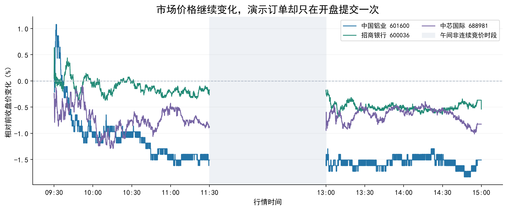
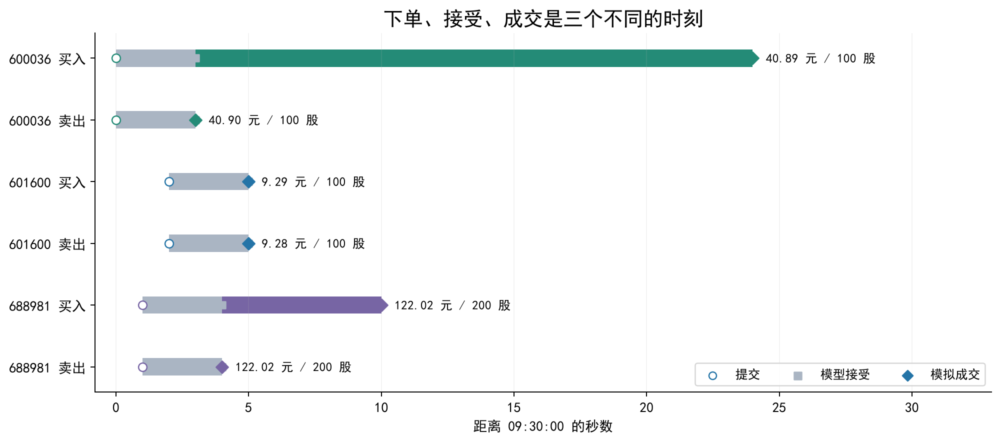
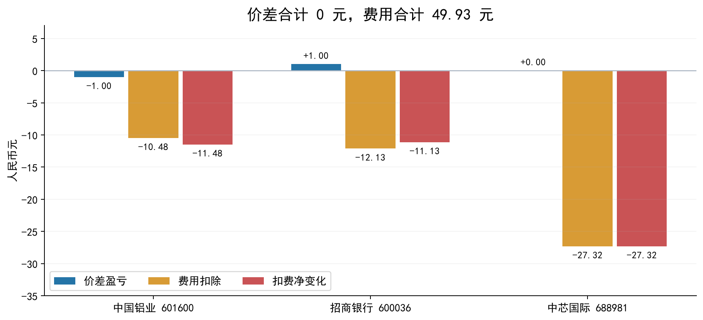
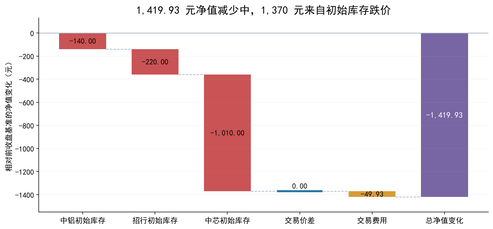
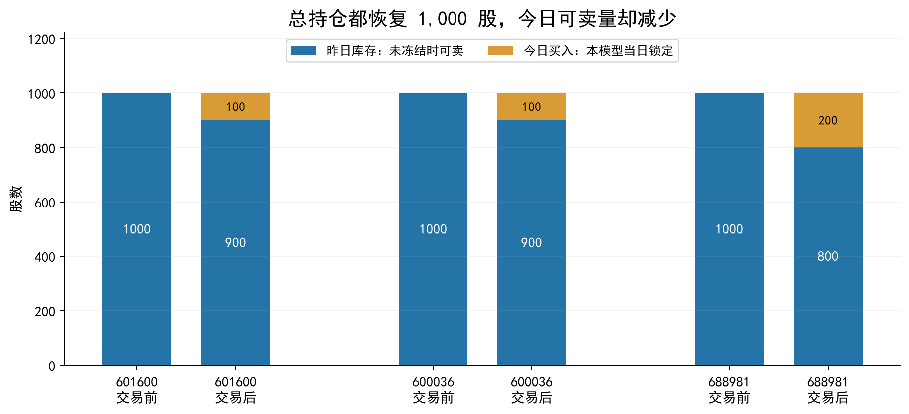
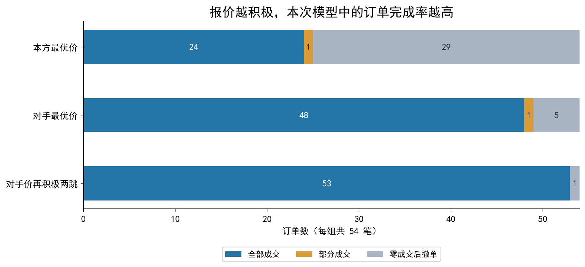
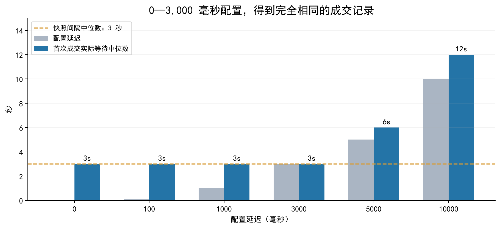
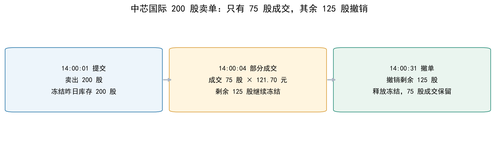

# 从六笔成交理解金融交易：模拟交易系统实践报告

**课程：QuantLLM 第三节实践课 · 数据日期：2026-09-23 · 撰写日期：2026-10-09**

> 我们搭建了交易规则、账户管理、订单撮合、历史行情回放和交互报告，并进一步用对照实验观察成交。本报告关注一个问题：**一条买卖指令从发出到成交、再到形成盈亏，究竟受到哪些金融机制约束？**
>
> 本文把交易知识与可核验的例子放在一起。图中数据来自本项目回放及实验；其中的成交是模型生成的模拟成交。费用采用教学配置，规则讲解限于本实验的普通主板、科创板 A 股。

## 阅读导航

| 想了解的问题 | 对应章节 |
| --- | --- |
| 买一、卖一和价差代表什么？ | 第 2 节：盘口与流动性 |
| 报价更积极，为什么更容易成交？ | 第 3、7 节：撮合与执行取舍 |
| 价格买低卖高，为什么仍亏损？ | 第 4 节：交易成本 |
| 账户亏损能否全部归因于交易？ | 第 5 节：盈亏归因 |
| 同日有买有卖，为何没有违反 T+1？ | 第 6 节：库存与可卖数量 |
| 配置 100 毫秒为何等了数秒？ | 第 8 节：时间分辨率 |
| 200 股订单为什么只成交 75 股？ | 第 9 节：部分成交与冻结 |
| 怎样判断一个回测是否可信？ | 第 10、11 节：证据与学习收获 |

## 1. 我们做了什么实验？

### 1.1 数据与系统

课堂数据包含逐笔委托 `ord`、逐笔成交 `exe` 和十档快照 `snp`。本次选择中国铝业（601600）、招商银行（600036）、中芯国际（688981），回放至 15:00。

| 项目 | 基线设置或结果 |
| --- | --- |
| 初始现金 | 1,000,000 元 |
| 初始库存 | 每只证券 1,000 股昨日库存 |
| 订单类型 | 限价订单 |
| 配置提交延迟 | 100 毫秒 |
| 处理事件 | 717,398 条：433,881 条委托、268,522 条历史成交、14,995 条快照 |
| 模拟订单 | 9 笔有效提交；其中 6 笔完全成交、3 笔立即撤销 |
| 拒单 | 9 次：数量不合规、越过涨跌停、可卖持仓不足各 3 次 |
| 模拟成交记录 | 6 条，全部在 09:30:03—09:30:24 |
| 验证 | 52 项自动测试通过；订单簿、账户冻结及成交延迟检查通过 |

这里的 **268,522 条历史成交**是市场输入；**6 条模拟成交**是我们的账户输出。两者不能混为一谈。历史剩余订单簿也没有被拿来重新撮合一次。



*图 1：行情快照最新价相对前收盘价的变化。午间区间断线，避免把午间连接线误读为交易。全天行情持续变化，但演示程序只在每只证券的第一份连续竞价快照提交一组订单。*

**学到的知识：市场活动、策略下单和账户成交是三个不同层面的事实。** 全天成交少，首先应检查是否持续发出了订单，不能直接解释成市场没有流动性。

### 1.2 对照实验

我们又做了两组实验，均提前固定设置，不根据未来收益挑选时点：

- **延迟实验**：同一演示，分别设置 0、100、1,000、3,000、5,000、10,000 毫秒延迟。
- **挂单探针**：在 09:30、10:00、10:30、11:00、13:00、13:30、14:00、14:30、14:56，每只证券第一份可见快照各提交一笔买单和卖单。每组共 54 笔，数量为主板 100 股、科创板 200 股；等待 30 秒后撤掉剩余量。

探针为了避免库存不足遮蔽成交行为，使用每只证券 **10,000 股昨日库存**，现金仍为 100 万元。其净值结果与同样初始账户的“不交易”基准比较，不能直接与基线账户的总净值变化比较。

## 2. 盘口：买一、卖一、价差和流动性

买一是当前最高买入报价，卖一是当前最低卖出报价。二者之间的差额称为买卖价差：

$$
\text{Spread}=\text{Ask}_1-\text{Bid}_1.
$$

以中铝 09:30:05 的实际可见快照为例：

| 盘口 | 价格 | 显示数量 |
| --- | ---: | ---: |
| 买一 | 9.28 元 | 24,000 股 |
| 卖一 | 9.29 元 | 292,500 股 |

这个时点的价差是 **0.01 元**。本模型中，买单可从卖盘获得流动性，卖单可从买盘获得流动性。因此两笔 100 股订单在同一份快照上分别以 9.29 元买入、9.28 元卖出，仅价格差就减少了 1 元现金。

我们由此区分两种下单意图：

| 意图 | 买单例子 | 希望获得的结果 | 需要承担的取舍 |
| --- | --- | --- | --- |
| 主动获得流动性 | 报价达到卖一 | 尽快与卖盘成交 | 接受对手报价，可能跨多个档位 |
| 被动等待流动性 | 挂在买一 | 等卖方来成交 | 可能排队、等不到成交或只成交一部分 |

**盘口中的数量是某个时点的显示量，不是给我们预留的额度。** 中铝卖一虽然显示 292,500 股，也不能据此推断一笔未来提交的巨额买单一定能按该价格成交；下单期间报价可能变化，其他订单也可能先成交或撤单。

本次被动订单仅在后续快照出现可跨越其限价的对手报价时成交。模型没有重建我们在真实队列中的位置，所以“挂买一”的探针也不等于已经获得真实的买一排队成交概率。

**学到的知识：流动性需要同时看价格、深度和可获得性。** 看到报价、能够申报、最终成交，是不同的条件。

## 3. 成交规则：限价约束、价格优先和时间优先

### 3.1 限价是价格边界，不是成交保证

买入限价表达“最高愿意支付多少”，卖出限价表达“最低愿意接受多少”。即使满足价格边界，仍需要对手数量与成交机会。

上交所规则的核心撮合原则是：买单中更高报价优先，卖单中更低报价优先；同方向同价时，按交易主机接收先后排序。限价边界、撮合优先级和连续竞价成交价格均见[规则原文第 3.2.8、3.5.1—3.5.3 条](https://www.sse.com.cn/lawandrules/sselawsrules2025/fund/trading/c/10817739/files/704204728fe74fff89de4f16efda4791.docx)。

本系统独立撮合内核有一个**合成示例**：

| 接收次序 | 订单 | 限价 | 数量 |
| --- | --- | ---: | ---: |
| 1 | 卖方先到 | 9.28 元 | 100 股 |
| 2 | 卖方后到 | 9.28 元 | 100 股 |
| 3 | 买方吃单 | 9.29 元 | 200 股 |

买方先成交第一笔卖单，再成交第二笔；两笔均按等待中的卖单价格 **9.28 元**成交，买方没有因为愿意付 9.29 元就必须支付 9.29 元。这个例子验证的是内核行为，不能算入六笔历史账户成交。

### 3.2 集合竞价与连续竞价

集合竞价把一批订单集中处理、形成共同成交价；连续竞价随订单到达逐笔处理。独立内核还用 9.29 元买单和 9.25 元卖单演示集合竞价，两边各 100 股，得到共同价格 9.27 元。

**历史账户回放没有执行集合竞价订单**，因为当前数据和模型不足以还原我们的真实竞价排队位置。这个区别帮助我们理解：实现某种撮合算法，不等于已有足够市场数据来验证其历史执行结果。

### 3.3 下单、接受、成交是不同事件

现实中，投资者向券商发出的是委托，券商向交易所提交的是申报；这两个环节并不相同。[上交所投教《委托与申报》](https://edu.sse.com.cn/service/hotline/qa/c/5151720.shtml)



*图 2：圆点表示提交，方点表示模型接受，菱形表示模拟成交。接受与成交同刻时，菱形覆盖方点。图中的“接受”是 `PaperBroker` 在下一份合格快照上作出的状态变化，不是实际交易所返回的确认。*

招商银行买单 09:30:00 提交，09:30:03 被模型接受，09:30:24 才成交。**有效订单仍可能等待价格条件满足。** 若只看最后成交时间，就会把价格等待也误当成网络延迟。

## 4. 交易成本：买低卖高，为什么仍然亏钱？

### 4.1 六笔成交的现金变化

三只证券的买卖数量分别相等，因此可以直接用价差计算这一组交易的毛现金变化：

$$
\text{毛盈亏}=(P_{sell}-P_{buy})Q,\qquad
\text{净盈亏}=\text{毛盈亏}-\text{买卖费用}.
$$

| 证券 | 买入价 | 卖出价 | 买卖数量 | 毛盈亏 | 买卖费用 | 扣费后 |
| --- | ---: | ---: | ---: | ---: | ---: | ---: |
| 中国铝业 601600 | 9.29 | 9.28 | 100 股 | −1.00 元 | 10.48 元 | −11.48 元 |
| 招商银行 600036 | 40.89 | 40.90 | 100 股 | +1.00 元 | 12.13 元 | −11.13 元 |
| 中芯国际 688981 | 122.02 | 122.02 | 200 股 | 0.00 元 | 27.32 元 | −27.32 元 |
| **合计** | — | — | — | **0.00 元** | **49.93 元** | **−49.93 元** |



*图 3：黄色柱表示费用扣除。招商银行虽然卖价比买价高 0.01 元，费用仍远大于这次价差收益。*

招商银行先卖出 100 股昨日库存，21 秒后买回 100 股。它确实获得了 1 元价差，但这组交易的最终现金变化为：

$$
(40.90-40.89)\times100-12.13=-11.13\ \text{元}.
$$

### 4.2 最低佣金为什么影响小单？

本系统按以下教学配置计费，不代表所有券商的真实报价：

| 项目 | 当前配置 |
| --- | --- |
| 佣金 | 成交金额的 0.03%，每笔订单累计最低 5 元 |
| 过户费 | 成交金额的 0.001%，买卖两边计提 |
| 卖出印花税 | 卖出金额的 0.05% |
| 金额计算 | 整数分记账，各费用按代码口径舍入 |

招商银行买入金额为 4,089 元，按比例算出的佣金只有约 1.23 元，模型仍收取最低 5 元；卖出也收最低 5 元。费用与金额的比例因此高于名义佣金费率。

若暂把本次买卖费用固定为 12.13 元，那么 100 股交易需要约 **0.1213 元/股**的价差才能覆盖它；以本系统 0.01 元的价格单位衡量，约需 13 个价格单位。实际费用会随成交金额变化，这只是帮助理解成本门槛的局部计算。

**学到的知识：方向判断正确、价差为正、扣费盈利，是三个不同的评价。** 增加订单数量会增加成本事件；把一笔委托拆成多个独立订单，也可能改变最低佣金负担。当前模型的一笔订单发生多次部分成交时，按累计金额计费，避免重复收取完整最低佣金。

## 5. 盈亏归因：账户跌了多少，交易额外造成了多少？

账户净值由现金和持仓市值组成：

$$
NAV=C+\sum_i Q_iP_i.
$$

基线初始持仓按前收盘价计价，因此初始净值为：

$$
1{,}000{,}000+1000\times(9.27+40.82+122.41)
=1{,}172{,}500\ \text{元}.
$$

期末模型净值为 **1,171,080.07 元**，减少 **1,419.93 元**。这并不等于交易行为亏了同样多。



*图 4：三只股票初始库存的跌价合计 1,370 元，交易价差为 0 元，交易费用为 49.93 元。归因之和与原报告净值变化完全一致。*

| 初始库存 | 前收盘价 | 期末快照最新价 | 1,000 股库存价差 |
| --- | ---: | ---: | ---: |
| 601600 | 9.27 元 | 9.13 元 | −140 元 |
| 600036 | 40.82 元 | 40.60 元 | −220 元 |
| 688981 | 122.41 元 | 121.40 元 | −1,010 元 |
| **合计** | — | — | **−1,370 元** |

如果完全不交易，仍持有这三份初始库存，期末净值也会减少 1,370 元。我们的六笔交易让总股数恢复原值，额外现金损失为 49.93 元，恰好是费用。

**学到的知识：评估交易行为，应与相同初始持仓的基准比较。** 价格下跌造成的库存风险、交易增量和交易费用应分别归因。期末净值是按报价计价的结果；尚未卖出的持仓价差也不能与现金到账混为一谈。

## 6. T+1：总持仓相同，为什么可卖数量不同？

普通 A 股的本次实验将当日买入数量锁定至后续交易日。其制度依据是证券在交收前的卖出限制及回转交易例外；并非所有证券品种都采用相同回转安排。[规则原文第 3.1.4—3.1.5 条](https://www.sse.com.cn/lawandrules/sselawsrules2025/fund/trading/c/10817739/files/704204728fe74fff89de4f16efda4791.docx)

我们可以在同一天先卖出已有昨日库存，再买入同量股票。这里卖出的可卖额度来自原有库存，不是刚买入的股票。



*图 5：三只证券总持仓均恢复至 1,000 股，但黄色部分属于今日买入，在当前模型中当天不能卖出。图示时活动委托均已结束，没有额外冻结股数。*

| 证券 | 交易前昨日库存 | 交易后昨日库存 | 今日买入 | 总持仓 | 当天可卖 |
| --- | ---: | ---: | ---: | ---: | ---: |
| 601600 | 1,000 | 900 | 100 | 1,000 | 900 |
| 600036 | 1,000 | 900 | 100 | 1,000 | 900 |
| 688981 | 1,000 | 800 | 200 | 1,000 | 800 |

账户必须分别维护：

$$
\text{总持仓}=\text{昨日库存}+\text{今日买入},\qquad
\text{可卖量}=\text{昨日库存}-\text{冻结股数}.
$$

这解释了基线中的三次 T+1 相关拒单：程序尝试把“昨日库存 + 今日买入”全部卖出，超出了当时可卖数量。

**学到的知识：持仓数量还带有可交易状态。** 股票还在账户中，不代表今天能卖；现金还在账户中，也不代表已冻结的那部分能再次用于下单。模型交收要求提供已核验的下一交易日，避免把周末或休市日当成自动解锁日。

## 7. 成交概率与成交价格：一个执行取舍实验

三种探针都使用**限价订单**。这里的“对手最优价”只是限价参考位置，不是把订单类型改成市价申报。

| 方式 | 买入限价 | 卖出限价 |
| --- | --- | --- |
| 本方最优价 | 买一 | 卖一 |
| 对手最优价 | 卖一 | 买一 |
| 对手价再积极两跳 | 卖一 + 0.02 元 | 买一 − 0.02 元 |



*图 6：每组分母都是 54 笔有效订单。蓝色为完全成交，黄色为部分成交，灰色为没有成交后撤销。每个时点只观察 30 秒窗口。*

| 方式 | 完全成交 | 部分成交 | 完全未成交 | 完全成交率 |
| --- | ---: | ---: | ---: | ---: |
| 本方最优价 | 24 | 1 | 29 | 44.44% |
| 对手最优价 | 48 | 1 | 5 | 88.89% |
| 再积极两跳 | 53 | 0 | 1 | 98.15% |

这个结果说明，在当前模型与固定窗口里，扩大可接受价格范围更容易完成订单。它没有说明每笔订单都支付了自己的限价，也没有证明这种报价方式的策略收益更好。

| 方式 | 费用 | 相对不交易的期末净值变化 | 期末净交易股数：601600 / 600036 / 688981 |
| --- | ---: | ---: | --- |
| 本方最优价 | 212.22 元 | −369.48 元 | 0 / −100 / +404 |
| 对手最优价 | 393.63 元 | −410.29 元 | 0 / −200 / −75 |
| 再积极两跳 | 428.84 元 | −507.45 元 | 0 / 0 / +200 |

净值指标还包括这些残留头寸的期末计价。三组的成交次数、费用和剩余风险不同，不能把净值表直接视作已经控制全部条件的策略排名。

**学到的知识：提高完成率通常需要让出一部分价格空间；等待更好价格可能增加未成交风险。** 被动成交还存在“为什么恰好在这时有人愿意与我成交”的问题，例如价格向不利方向移动后才碰到挂单。这是理解逆向选择的出发点，但本样本不足以证明该机制主导了某一组收益。

## 8. 延迟与采样：100 毫秒不等于 100 毫秒成交



*图 7：配置 0—3,000 毫秒时，首次成交等待时间中位数均为 3 秒，且成交明细逐项相同。三只证券的连续竞价快照间隔中位数都是 3 秒。*

| 配置延迟 | 成交记录数 | 首次成交等待中位数 | 相对不交易的期末净值变化 |
| --- | ---: | ---: | ---: |
| 0 ms | 6 | 3 秒 | −49.93 元 |
| 100 ms | 6 | 3 秒 | −49.93 元 |
| 1,000 ms | 6 | 3 秒 | −49.93 元 |
| 3,000 ms | 6 | 3 秒 | −49.93 元 |
| 5,000 ms | 6 | 6 秒 | −39.93 元 |
| 10,000 ms | 7 | 12 秒 | −22.66 元 |

当前成交模型只检查延迟到期后的新快照。订单还可能因限价、深度不足继续等待。因此实际等待包含传输假设、快照采样和价格条件三部分，不能用一个延迟参数概括。

10 秒延迟组的亏损较小，是这个小样本中的价格路径结果。例如招行卖单由基线的 40.90 元改为 41.08 元，中芯卖单则分成两次成交。**不能据此推出“故意慢一些更赚钱”。** 新样本、更细行情、真实排队机制都可能改变结果。

**学到的知识：回测数据的时间分辨率限制了能够验证的问题。** 用约 3 秒快照研究百毫秒级执行差异，本身就缺少足够观测能力。

## 9. 部分成交：订单数量约束不等于每次成交数量

科创板限价申报的数量要求与零股卖出安排见[上交所科创板投教问答](https://edu.sse.com.cn/tib/qa/)。本系统对普通主板买入采用 100 股整数倍，对科创板常规限价采用至少 200 股的申报约束；但已经合规提交的订单可以只成交一部分。



*图 8：探针实验中，中芯国际“对手最优价”卖单的真实模型事件顺序。200 股委托只成交 75 股，剩余 125 股在提交 30 秒后撤销。*

这笔单的成交金额为：

$$
121.70\times75=9{,}127.50\ \text{元}.
$$

在 14:00:04 成交之后，账户需同时记录“已经成交 75 股”与“还有 125 股待成交”。撤单只针对后者，不能撤销已经发生的 75 股成交。

另一笔 10:30 的中芯卖单只成交 196 股，留下 4 股后撤销，进一步说明申报合规性与逐次成交数量属于不同环节。

资源管理在这里也有金融含义：

| 状态 | 现金与库存的变化 |
| --- | --- |
| 买单提交 | 预留限价金额和费用，防止资金重复使用 |
| 卖单提交 | 冻结可卖库存，防止同一库存重复卖出 |
| 部分成交 | 更新已成交部分，保留剩余委托所需的冻结资源 |
| 撤单确认 | 释放未成交部分对应资源，已成交部分保留 |
| 本模型收盘失效 | 剩余日内订单失效，释放相应资源 |

**学到的知识：订单是一组会逐步变化的权利和约束。** “撤单成功”不等于“这一笔交易从未发生”；也不能只保存一个成交布尔值而忽略已成交数量、剩余量和累计费用。

## 10. 可信回测需要哪些证据？

### 10.1 用守恒检查账户，用基准检查收益

我们已核验以下关系：

- 每笔订单：已成交数量 + 剩余数量 = 原申报数量；终止订单的剩余量仅保留为历史信息，不再冻结。
- 冻结现金：等于活动订单剩余预留金额之和。
- 冻结股数：等于活动卖单剩余股数之和，并且不超过昨日库存。
- 成交时间：不得早于订单的配置到达时刻。
- 归因结果：初始库存价差 + 净交易现金变化 + 净新增持仓期末计价 = 总净值变化。

100 毫秒实验的六条成交与原回放逐项相同；低延迟组的明细相等也用断言验证。上述证据支持“实验按当前模型可复现”，没有把模拟成交转化成实盘证明。

### 10.2 历史订单簿与快照不能总是精确对齐

| 时间段 | 可比较快照 | 买卖最优价同时一致率 |
| --- | ---: | ---: |
| 09 时 | 1,800 | 76.28% |
| 10 时 | 3,600 | 88.42% |
| 11 时 | 1,799 | 93.00% |
| 13 时 | 3,600 | 90.08% |
| 14 时 | 3,419 | 88.10% |
| **全天** | **14,218** | **87.80%** |

这个比例是“最优买卖价同时一致”的诊断，不是十档数量完全相同，更不是算法正确率。逐笔与快照同毫秒的先后、跨通道接收时间不完整，都会影响对照。

没有未来数据参与申报判断，也不意味着数据天然足够精细。收盘价格可以用于事后收益计价；它不能倒过来成为早盘下单的理由。

### 10.3 模型还没有解释的部分

| 当前实验能支持的结论 | 仍缺少的证据 |
| --- | --- |
| 本账户冻结、部分成交、撤单和 T+1 状态按实现流转 | 实际券商回报与清算核对 |
| 下一份可见十档快照上存在可用的模型深度 | 我们是否排在真实订单队列前方 |
| 相同快照不能在同一时间重复供给流动性 | 不同时点重复显示的历史挂单是否已被模拟消耗 |
| 给定小订单的无冲击模拟价格 | 大单导致的市场冲击及其他参与者反应 |
| 一个交易日、三只证券的对照差异 | 跨日期、跨行情状态的稳定性与置信区间 |

还需区分涨跌停与连续竞价有效价格范围：它们分别约束相对前收盘价和相对即时基准价的报价。科创板的有效申报范围及保护限价可见[上交所相关投教说明](https://edu.sse.com.cn/best/audio/tjxwc/c/5331863.shtml)。本系统仍只支持教学范围内的常规限价股，不能把课堂参数套到所有 IPO、停牌或特殊证券状态。

## 11. 我们真正学到了什么？

| 金融交易知识 | 本次最直接的证据 | 对交易系统设计的启发 |
| --- | --- | --- |
| 盘口价差是一种执行成本来源 | 中铝同一快照买 9.29、卖 9.28 | 成本分析同时记录买卖报价 |
| 限价控制边界，不保证成交 | 招行买单接受后仍等到 09:30:24 | 接受、等待、成交分别记录 |
| 价格与时间决定撮合优先级 | 独立内核同价两卖单按接收顺序成交 | 不能用最终价格代替队列序号 |
| 正毛收益也可能是负净收益 | 招行赚 1 元价差、付 12.13 元费用 | 收益指标必须包括费用 |
| 最低佣金会影响小单成本比例 | 4,089 元买单触发最低 5 元佣金 | 使用实际费用口径，不只填名义费率 |
| 库存波动与交易增量要分开 | 1,370 元库存损失与 49.93 元交易损失 | 使用相同初始账户的不交易基准 |
| 持仓数量不等于可卖数量 | 中芯总股数 1,000，可卖只有 800 | 拆分昨日、今日、冻结持仓 |
| 成交率与价格空间存在取舍 | 三种报价的完全成交率明显不同 | 执行评估同时衡量完成率与风险 |
| 部分成交改变剩余资源 | 200 股卖单成交 75 股、余 125 股撤销 | 保存累计成交、余量和累计费用 |
| 数据采样限制执行研究 | 0—3 秒延迟的成交明细相同 | 先问数据是否足以区分参数 |
| 模型可复现与真实可成交不同 | 守恒通过，真实队列仍未知 | 明确模型边界，逐步核验实际回报 |

这次实践把“买低卖高”的直觉拆成了可检查的条件：先有合法可用的资源，再有有效订单和对手流动性，随后形成成交与费用，最后还要把交易增量同原有库存风险分开。**金融知识在交易系统中表现为具体的状态、约束和记账关系。**

## 附录 A：术语速查

| 术语 | 本报告中的含义 |
| --- | --- |
| 买一 / 卖一 | 最高买入报价 / 最低卖出报价 |
| Tick | 最小价格变动单位；本系统普通 A 股使用 0.01 元 |
| 买卖价差 | 卖一减买一，反映两个最优报价之间的距离 |
| 深度 | 各价位显示的待成交数量 |
| 毛盈亏 / 净盈亏 | 费用扣除前 / 后的收益口径 |
| 滑点 | 实际成交价相对预先指定价格基准的差异；必须明确基准 |
| 库存风险 | 持有头寸因市场价格变化而产生的价值变化 |
| T+1 | 本实验普通 A 股买入份额在后续交易日才成为可卖库存 |
| 逆向选择 | 获得成交的时刻可能与后续不利价格变化相关 |
| 盯市 / 期末计价 | 用指定时点报价评估未平仓头寸的价值 |

## 附录 B：数据、复现及来源

### 项目证据

正文统计来自原始 [summary.json](evidence/summary.json)、[trades.json](evidence/trades.json)、`frames.json` 和 `events.jsonl`；对照明细来自 [observations.json](evidence/observations.json) 与 [probe_orders.csv](evidence/probe_orders.csv)。便携 ZIP 中另附 `evidence.json`，汇总绘图数据与输入 SHA256；完整逐笔资料仍保存在服务器项目中。

已有 [交互报告下载](https://github.com/QiyuZhang-new/pku_quantllm/releases/download/lesson03-report-20261009/report.html) 和 [课程 issue 提交记录](https://github.com/aslan9/pku_quantllm/issues/6#issuecomment-6080048205) 对应的是原全天回放报告。

在 `lesson03` 目录执行：

```bash
# 原有系统检查
.venv/bin/python -m unittest discover -s tests -v

# 重新生成成交观察数据
.venv/bin/python scripts/observe_trading.py

# 安装可选绘图依赖，然后生成插图
.venv/bin/python -m pip install -r requirements-report.txt
.venv/bin/python scripts/build_trading_figures.py
```

图表全部以 Matplotlib 无界面模式生成，每张同时保存 PNG 和 SVG。Markdown 使用相对 PNG 路径，解压便携包后请保留 `REPORT.md` 与 `figures/` 的相邻目录结构。复现数据与绘图的脚本在服务器项目 `scripts/` 中，ZIP 内附副本。完整重绘需把脚本放回原项目 `scripts/` 并保留服务器上的 `frames.json`；便携包用于阅读和核对统计，不包含全部行情帧。

### 规则来源

规则说明已于 2026-10-09 核对。2026 修订版发布通知正文写明 2026-07-06 起施行，并列有暂缓实施条文；页面元数据仍带有“尚未施行”标签。本报告采用通知正文及项目保存的附件文本讲解一般机制，未把暂缓条文或特殊证券安排扩展为已实现功能。

- [上交所《交易规则（2026 年修订）》发布通知](https://www.sse.com.cn/lawandrules/sselawsrules2025/fund/trading/c/c_20260424_10817739.shtml)及[规则附件](https://www.sse.com.cn/lawandrules/sselawsrules2025/fund/trading/c/10817739/files/704204728fe74fff89de4f16efda4791.docx)：限价、交收前卖出限制、撮合优先级和成交价格。
- [上交所投教《委托与申报》](https://edu.sse.com.cn/service/hotline/qa/c/5151720.shtml)：投资者、券商、交易所之间的指令传递。
- [上交所科创板投教问答](https://edu.sse.com.cn/tib/qa/)：科创板申报数量及差异化安排。
- [上交所科创板交易规则投教说明](https://edu.sse.com.cn/best/audio/tjxwc/c/5331863.shtml)：有效申报范围和保护限价。

费用参数、实验收益和图中数值来自本项目，不使用规则页面来替代它们的实测证据。
